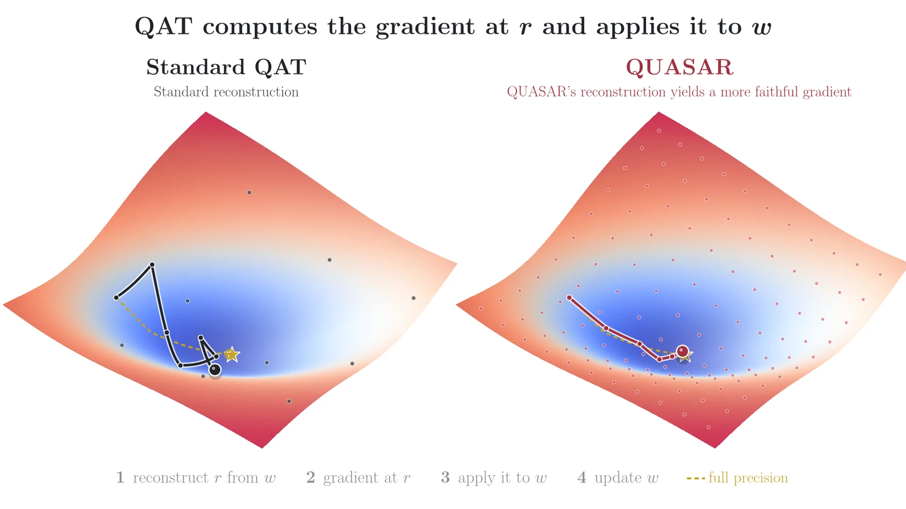
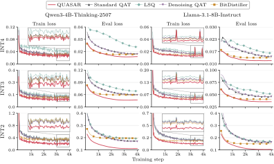

# QUASAR

<p align="center">
  <a href="https://quasar-qat.github.io/"></a>
  <a href="https://arxiv.org/abs/2608.13966"></a>
  <a href="https://huggingface.co/collections/QUASAR-QAT/all-quasar-models-6aab09fd2913ec22df0d5f15"></a>
</p>

**QUASAR reaches lower training and evaluation loss than every QAT baseline at INT4, INT3 and INT2, and the
quantized model deploys exactly like round-to-nearest.**

<p align="center">
  
</p>

QUASAR is a quantization-aware training (QAT) method for LLMs. At every training step it reconstructs each
group of weights by searching a few clipping ranges and fitting the dequantizer with saliency-weighted
least squares, using the second moment AdamW already tracks as the saliency. Only training changes: the
quantized model has the same format as a round-to-nearest checkpoint (INT2/3/4 or NVFP4).

<p align="center">
  
</p>
<p align="center"><i>Quantization-aware distillation of Qwen3-4B-Thinking-2507 and Llama-3.1-8B-Instruct: training and
held-out loss (KL to the BF16 model) at INT4, INT3 and INT2.</i></p>

## Checkpoints

| Model | Checkpoints |
|---|---|
| Qwen3.5-4B | [NVFP4](https://huggingface.co/QUASAR-QAT/Qwen3.5-4B-QUASAR-NVFP4) · [NVFP4 W4A4](https://huggingface.co/QUASAR-QAT/Qwen3.5-4B-QUASAR-NVFP4-W4A4) · [GGUF Q4_0](https://huggingface.co/QUASAR-QAT/Qwen3.5-4B-QUASAR-Q4_0-GGUF) |
| Qwen3.8-27B | [NVFP4](https://huggingface.co/QUASAR-QAT/Qwen3.8-27B-QUASAR-NVFP4) |
| Gemma-4 E4B | [INT4](https://huggingface.co/QUASAR-QAT/gemma-4-E4B-it-QUASAR-W4A16-G64) · [GGUF Q4_0](https://huggingface.co/QUASAR-QAT/gemma-4-E4B-it-QUASAR-Q4_0-GGUF) |
| Gemma-4 12B | [INT4](https://huggingface.co/QUASAR-QAT/gemma-4-12B-it-QUASAR-W4A16-G64) · [GGUF Q4_0](https://huggingface.co/QUASAR-QAT/gemma-4-12B-it-QUASAR-Q4_0-GGUF) |
| Muse-Glimmer-30B | [NVFP4](https://huggingface.co/QUASAR-QAT/Muse-Glimmer-30B-QUASAR-NVFP4) · [NVFP4 W4A4](https://huggingface.co/QUASAR-QAT/Muse-Glimmer-30B-QUASAR-NVFP4-W4A4) · [GGUF Q4_0](https://huggingface.co/QUASAR-QAT/Muse-Glimmer-30B-QUASAR-Q4_0-GGUF) |

## Install

```bash
git clone https://github.com/vincentcounathe/quasar-qat && cd quasar-qat
pip install -e .            # quantizer and trainer
pip install flash-attn --no-build-isolation   # FlashAttention-2, used by the training recipes
pip install -e ".[eval]"    # + evaluation (vLLM, lm-eval, math-verify)
```

## Quickstart

Add QUASAR to any training loop that uses AdamW:

```python
import torch
from transformers import AutoModelForCausalLM
from quasar.export import save_materialized
from quasar.quant import QuantConfig, quantize_model, snapshot_saliency

path = "Qwen/Qwen3-4B-Thinking-2507"
model = AutoModelForCausalLM.from_pretrained(path, dtype=torch.bfloat16, device_map="cuda")
quantize_model(model, QuantConfig("quasar", bits=2))  # INT2, groups of 128
optimizer = torch.optim.AdamW(model.parameters(), lr=5e-5)

for batch in batches:
    model(**batch).loss.backward()
    optimizer.step()
    snapshot_saliency(model, optimizer)
    optimizer.zero_grad()

save_materialized(model, "qwen3-4b-w2", model_path=path)
```

The saved model is a regular Hugging Face checkpoint. Use `QuantConfig("quasar", format="nvfp4")` for
NVFP4, or `"standard"`, `"lsq"`, `"denoising"`, `"bitdistiller"` for the baselines.

## Train and evaluate

Training data is a JSONL file with one chat per line: `{"messages": [{"role": "user", ...}, {"role": "assistant", ...}]}`.

```bash
torchrun --nproc_per_node 8 -m quasar.train --recipe configs/heal_qwen3_4b_thinking.yaml \
    --method quasar --bits 2 --train_data train.jsonl --eval_data eval.jsonl --out_dir runs/w2_quasar

python -m quasar.eval.suite --table healing --family qwen --model runs/w2_quasar/materialized \
    --heldout eval.jsonl --ruler_data runs/ruler_qwen --out_dir runs/w2_quasar/eval
```

`--method` is one of `quasar`, `standard`, `lsq`, `denoising`, `bitdistiller`. Any recipe field can be
overridden on the command line, e.g. `--learning_rate 3e-5`. To build training data from a teacher model,
see `quasar/data`.

## Reproduce the paper

Each script trains QUASAR and every baseline at each bit width, then evaluates them:

```bash
DATA_DIR=/path/to/data FAMILY=qwen  scripts/reproduce_healing.sh   # Qwen3-4B-Thinking-2507
DATA_DIR=/path/to/data FAMILY=llama scripts/reproduce_healing.sh   # Llama-3.1-8B-Instruct
DATA_DIR=/path/to/data scripts/reproduce_adaptation.sh             # Qwen3-4B-Base, math reasoning
DATA_DIR=/path/to/data scripts/reproduce_nvfp4.sh                  # Qwen3-8B, NVFP4
```

`DATA_DIR` holds `train.jsonl` and `eval.jsonl`. Results go to `runs/` (set `OUT_ROOT` to change it).

## Repository layout

```
quasar/quant/    QUASAR and the baselines (Standard QAT, LSQ, Denoising QAT, BitDistiller); INT and NVFP4
quasar/train/    FSDP2 trainer for distillation and fine-tuning
quasar/eval/     KL, perplexity, math, MMLU-Pro, SuperGPQA, LiveCodeBench, LongBench-v2, RULER
quasar/data/     chat formatting and corpus tools
quasar/export/   saving quantized checkpoints, NVFP4 packing
configs/         paper recipes
scripts/         end-to-end reproduction
```

## Citation

```bibtex
@article{counathe2026quasar,
  title   = {{QUASAR}: Lowering the Loss Floor of Quantization-Aware Training with Loss-Aware Reconstruction},
  author  = {Counathe, Vincent and Athiwaratkun, Ben and De Sa, Christopher and Zhang, Tianyi},
  journal = {arXiv preprint arXiv:2608.13966},
  year    = {2026}
}
```

## License

[Apache 2.0](LICENSE)
